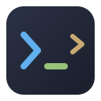
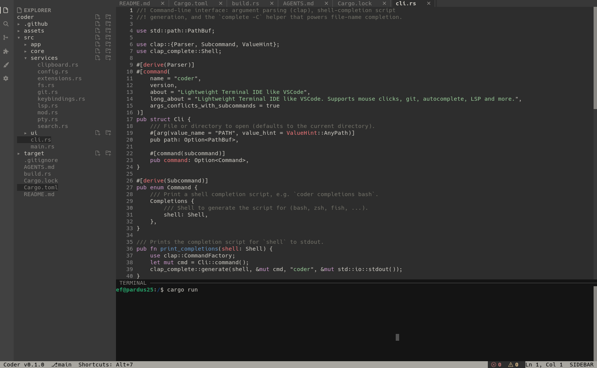

<div align="center">



# coder

**A lightweight terminal IDE that feels like VSCode.**

Mouse clicks, git, autocomplete, LSP, themes and an embedded terminal — all inside your terminal.

Written in Rust with [ratatui](https://ratatui.rs).



</div>


## Why

Terminal editors usually ask you to learn a new way of working. `coder` does not.
Click a file, click a tab, drag to select text, press `Ctrl+S` to save. Everything works how you expect.
It starts instantly and uses very little memory.

## Features

- **Mouse everywhere** — click tabs, files, buttons and checkboxes. Drag to select text, drag borders to resize panels, drag the scrollbar.
- **File explorer** — lazy tree, create new files and folders inline.
- **Syntax highlighting** — powered by syntect, works for most languages out of the box.
- **LSP support** — autocomplete, diagnostics with inline squiggles, and formatting. Just point the config at a language server.
- **Git panel** — branch, staged/unstaged tree, stage, unstage, revert, commit, fetch, pull, push and commit history.
- **Git diff view** — open any changed file as a diff tab. Added lines green, removed lines shown inline in red.
- **Change gutter** — every file shows its git changes next to the line numbers and on the scrollbar.
- **Find & replace** — in the current file (`Ctrl+F` / `Ctrl+H`) or across the whole project, with regex support.
- **Embedded terminal** — a real shell in a split panel (`Ctrl+J`).
- **Themes** — Dracula, Gruvbox, Nord, One Dark, Monokai, Tokyo Night, Catppuccin and more. Switch live, your choice is saved.
- **Auto reload** — files changed outside the editor reload automatically, unless you have unsaved edits.

## Install

### From source

Clone the maintained repository and build it with Rust:

```bash
git clone https://github.com/HaeMeto/coder-cli-explorer.git
cd coder-cli-explorer
cargo install --path .
```

To upgrade an existing source installation:

```bash
cd coder-cli-explorer
git pull --ff-only
cargo install --path . --force
```

### From a release

Prebuilt binaries and installers are available on the
[GitHub Releases page](https://github.com/HaeMeto/coder-cli-explorer/releases).
The commands below download release `v0.1.3`; replace `VERSION` with another
release tag when needed.

Linux x86_64 (`.tar.gz`):

```bash
VERSION=v0.1.3
curl -fL -o "coder-${VERSION}.tar.gz" \
  "https://github.com/HaeMeto/coder-cli-explorer/releases/download/${VERSION}/coder-${VERSION}-x86_64-unknown-linux-gnu.tar.gz"
tar -xzf "coder-${VERSION}.tar.gz"
mkdir -p "$HOME/.local/bin"
install -m 755 "coder-${VERSION}/coder" "$HOME/.local/bin/coder"
```

Linux packages (`.deb` / `.rpm`) can be downloaded from the same release and
installed with the system package manager:

```bash
# Debian/Ubuntu
sudo apt install ./coder-v0.1.3-x86_64-unknown-linux-gnu.deb

# Fedora/RHEL/openSUSE
sudo dnf install ./coder-v0.1.3-x86_64-unknown-linux-gnu.rpm
```

For macOS and Windows, download the archive or installer matching your
architecture from the release page. macOS assets use
`aarch64-apple-darwin` or `x86_64-apple-darwin`; Windows assets use
`x86_64-pc-windows-msvc` or `aarch64-pc-windows-msvc` and include `.zip`,
`.exe`, and `.msi` variants.

Icons use a Nerd Font. If your terminal font has none, run with `CODER_ASCII=1`.

## Usage

```bash
coder            # open the current directory
coder src/       # open a directory
coder main.rs    # open a single file
```

Shell completion:

```bash
coder completions bash > /etc/bash_completion.d/coder
coder completions zsh  > ~/.zfunc/_coder
coder completions fish > ~/.config/fish/completions/coder.fish
```

## Shortcuts

| Key | Action |
|-----|--------|
| `Ctrl+Q` | Quit |
| `Ctrl+S` | Save |
| `Ctrl+W` | Close tab |
| `Ctrl+B` | Toggle sidebar |
| `Ctrl+J` | Toggle terminal |
| `Ctrl+F` / `Ctrl+H` | Find / Find & replace |
| `Ctrl+Space` | Autocomplete |
| `Ctrl+Alt+F` | Format file |

Editing works the usual way: arrows, `Home`/`End`, `PageUp`/`PageDown`, `Shift` to select, `Ctrl+←`/`→` to jump words, `Ctrl+C`/`X`/`V`/`Z`/`Y`/`A`.

## Configuration

Settings live in `~/.config/coder/config.toml`. The file is created on first run and you can edit it by hand.

```toml
theme = "base16-ocean.dark"
format_on_save = false
trim_trailing_whitespace = true
insert_final_newline = true
inline_diagnostics = true

[rust]
extensions = ["rs"]
lsp = "rust-analyzer"
formatter = "rustfmt --edition 2021"
linter = ""

[python]
extensions = ["py", "pyi"]
lsp = "ruff server"
formatter = "ruff format -"
linter = ""
```

Adding a language means adding a section. Install the language server yourself, then name its command in `lsp`.
An empty string means the tool is not used.

### Environment variables

| Variable | Meaning |
|----------|---------|
| `CODER_ASCII=1` | Use ASCII icons instead of Nerd Font glyphs |
| `CODER_CONFIG` | Path of the config file |
| `CODER_THEMES_DIR` | Extra folder with `.tmTheme` files |
| `CODER_SYNTAXES_DIR` | Extra folder with `.sublime-syntax` files |

## Development

```bash
cargo run [dir]   # run
cargo test        # tests
cargo clippy      # lint
```

The code follows the Elm Architecture: `Model` holds all state, `Msg` describes what happened, `update` changes the state, `Cmd` runs side effects, and `view` draws. See [AGENTS.md](AGENTS.md) for the full map.

## License

MIT
</content>
